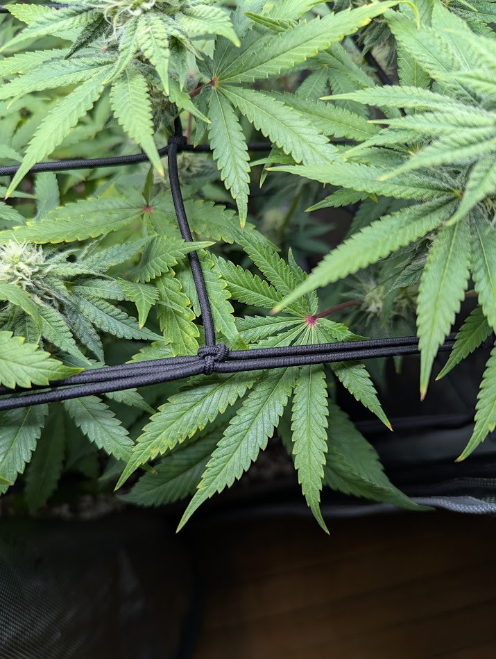
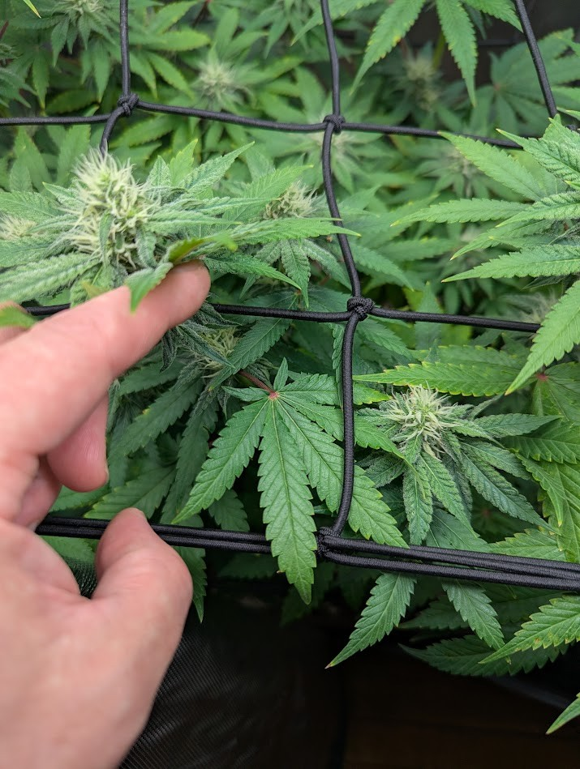
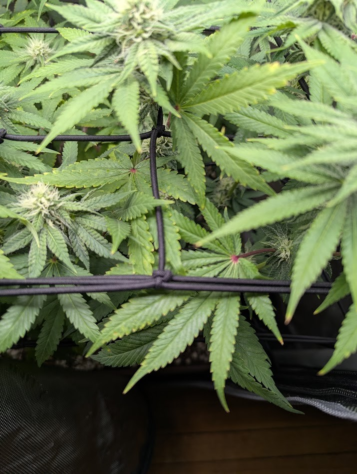

## Follow-up — close-up verification

**Resolved — no mites.** After the daily shot flagged reddish specks near the bottom-right net junctions, the grower submitted three close-up phone photos of that area (below). The specks are **red petiole / leaf-junction coloration** — anthocyanin pigment at the nodes where the leaflets meet the stem, the same coloration already visible plant-wide, not pests. No webbing, no stippling, and no mites (pest or predatory) anywhere in the close-ups; leaves are turgid and healthy green with only minor light-related tip/margin yellowing. The bottom-right watch item is **cleared.** Worth ruling out given the spider-mite episode confirmed and treated on 6/9 — and it's ruled out.

This coloration is **benign because the plant is otherwise healthy and vigorous**, not because we know its cause. Red/purple petioles have several possible triggers — genetics, strong light, cool nights, or a phosphorus/magnesium issue — and they can't be told apart from a photo; a cause is only worth pursuing if it appears alongside other symptoms and a growth stall, which it does not here ([Royal Queen Seeds](https://www.royalqueenseeds.com/blog-should-you-worry-about-purple-or-red-cannabis-stems-n1311); KB `10-symptom-index.md`, `01-diagnosis-framework.md`). Given this plant's logged light-stress sensitivity (6/22), environmental/light stress is a plausible contributor; whether Papaya Crush colors genetically is undocumented (KB `strains/papaya-crush.md`). Either way it needs no action.

